
<h1 align="center">基于冲突动态监测算法的健身房预约系统的设计与实现+vue</h1>

## 简介
基于冲突动态监测算法的健身房预约系统：角色分为管理员、用户；提供用户管理、课程预约、设备管理、公告管理、留言反馈等功能。    --计算机毕业设计源码；毕设源码；java毕业设计源码

## 联系方式

<h3 align="center">获取完整代码与数据库文件 + 微信：deepguan QQ: 86050149 QQ群: 783742310</h3>

<h3 align="center">可帮忙远程部署 包运行成功！提供远程部署、修改代码、设计文档指导、代码讲解等服务！</h3>

## 功能介绍（完整见运行截图）
管理员：具备管理用户、教练和课程的功能，通过搜索栏查询特定信息，可进行详情查看、修改或删除数据。可以审核预约申请，包括输入审核意见，并管理公告与留言反馈。提供对预约进行审核、查看详情及删除的操作权限。支持对用户信息、自助健身预约数据的管理和验证。  
用户： 可以通过网站首页的主导航栏访问预约系统的不同功能模块。能够浏览和预约健身课程、私教课程和自助健身项目，并查看课程详情。可以在个人中心管理个人信息、查看预约记录和教学计划，进行在线课程或器械预订。支持查看自己的预约信息和已发布的公告。  
教练：管理个人课程信息和用户预约，查看用户反馈并回复留言。能够上传和更新关于自己的课程、擅长项目和相关资料。与用户进行课程安排和互动，帮助优化预约流程。

## 运行截图

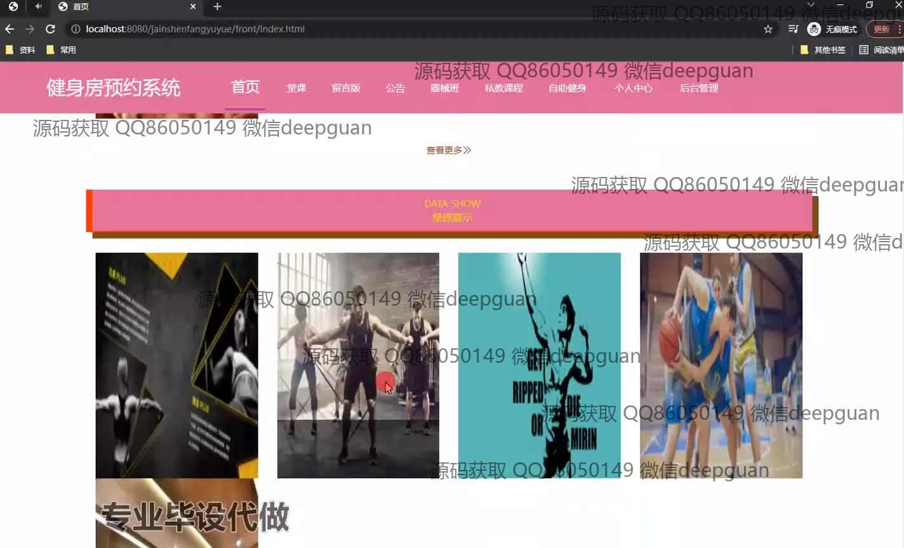

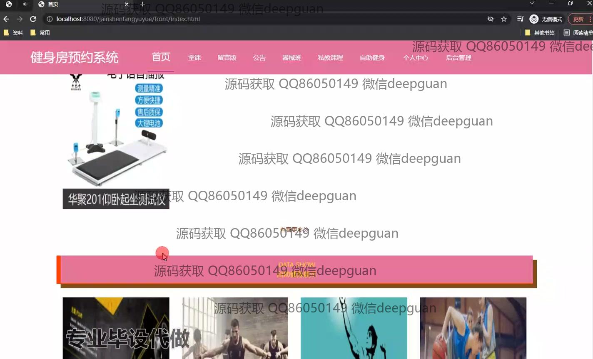

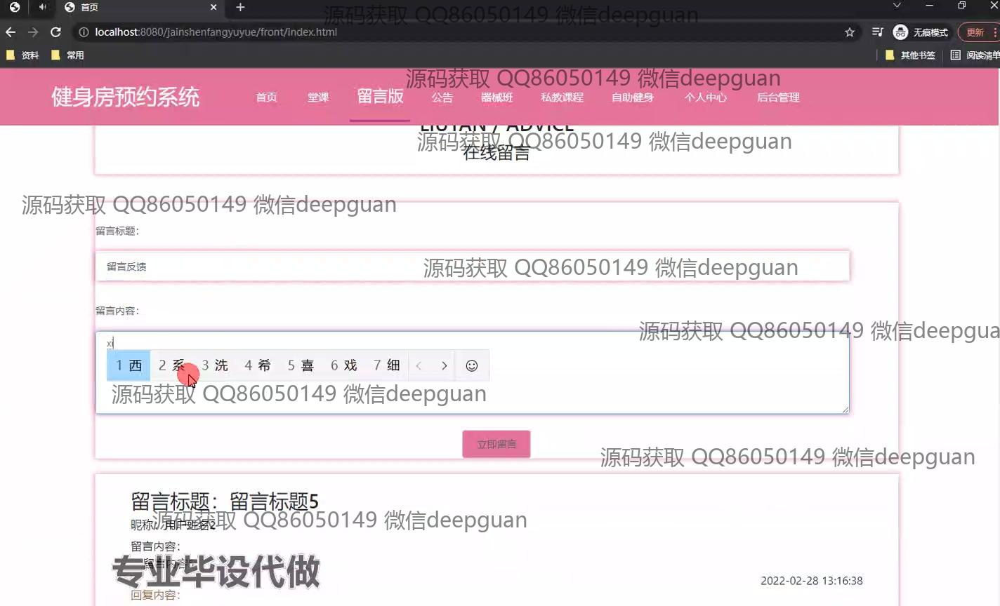

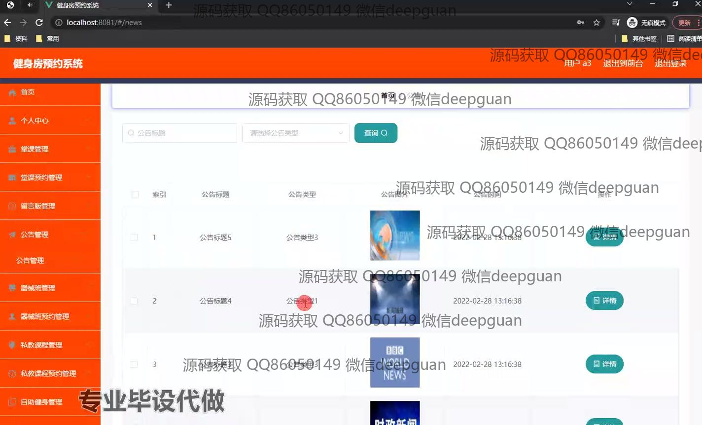

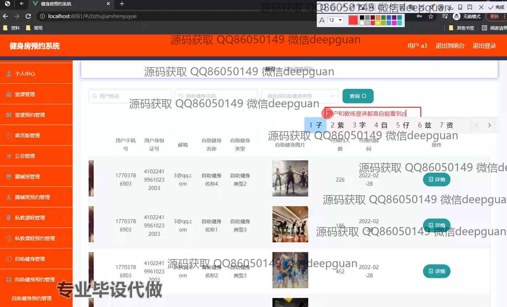

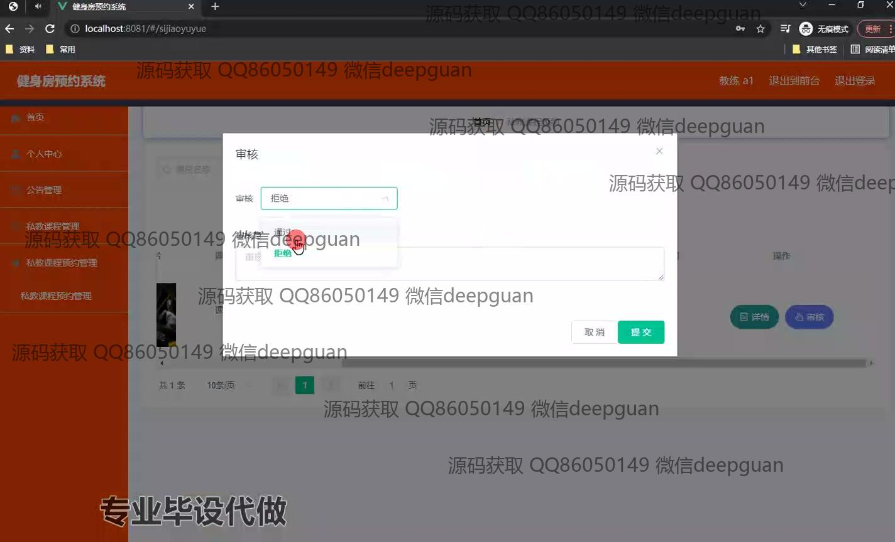
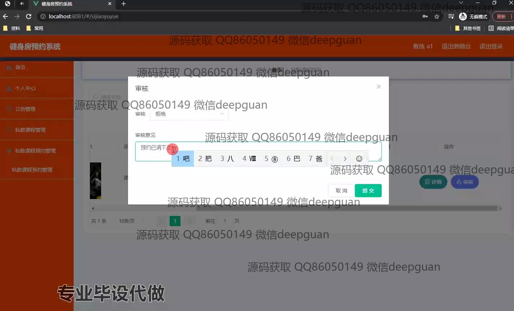

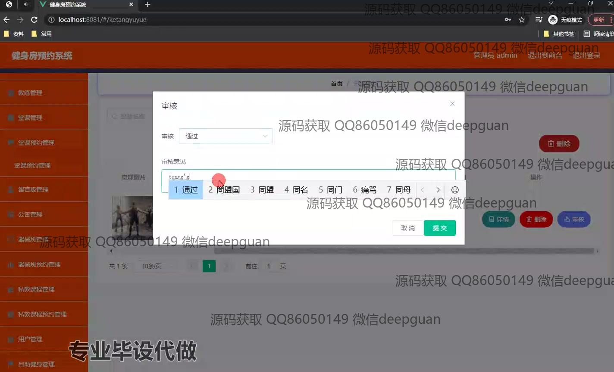
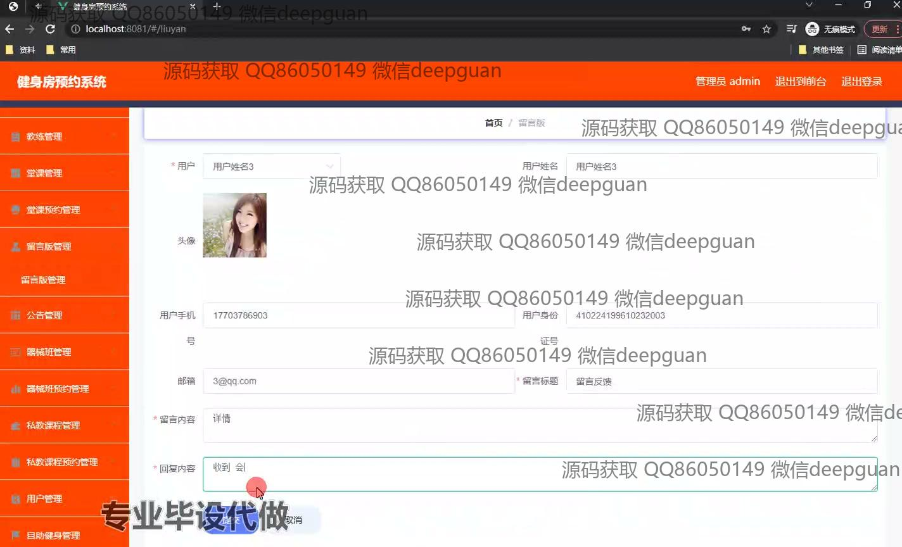
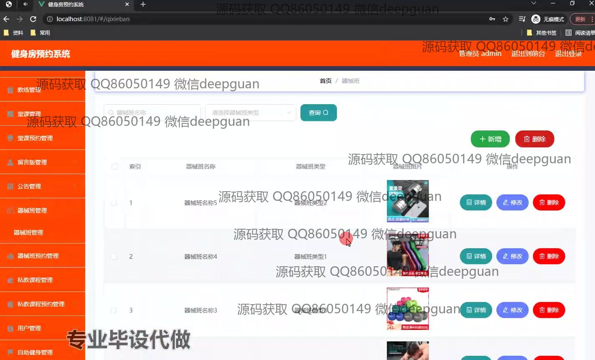
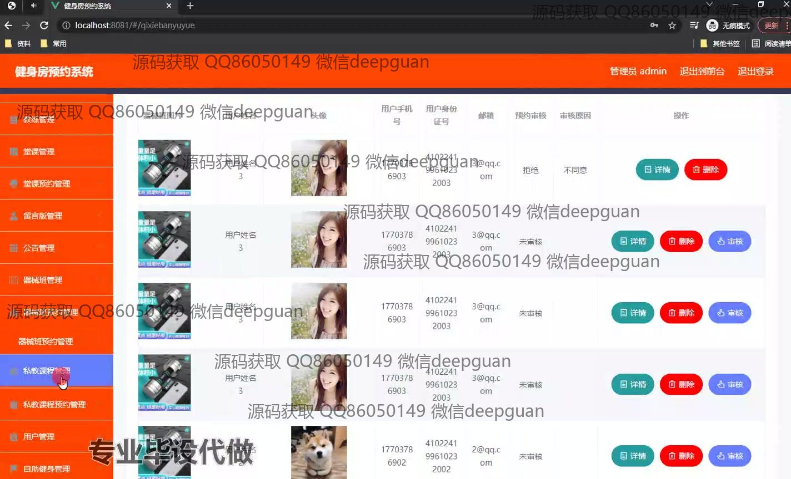
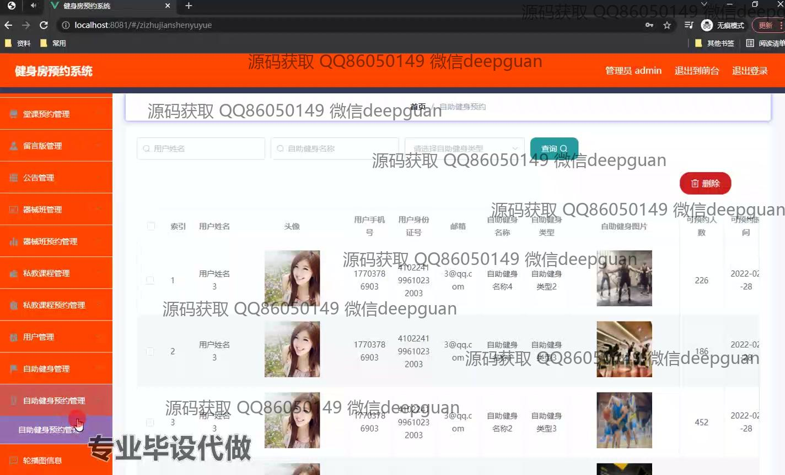

本代码来源于网络,仅供学习参考使用!

